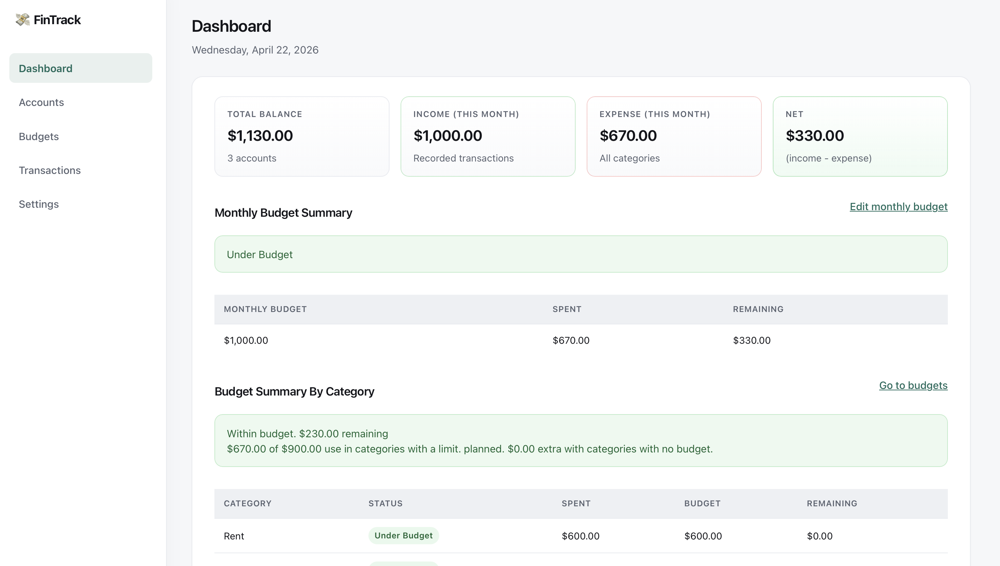
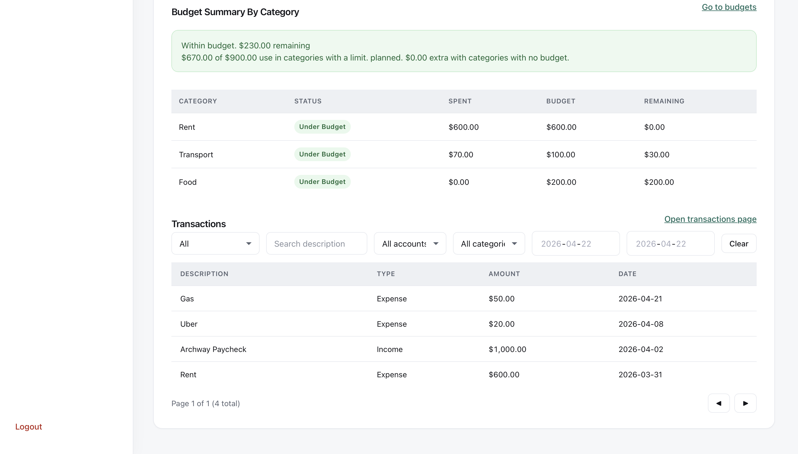
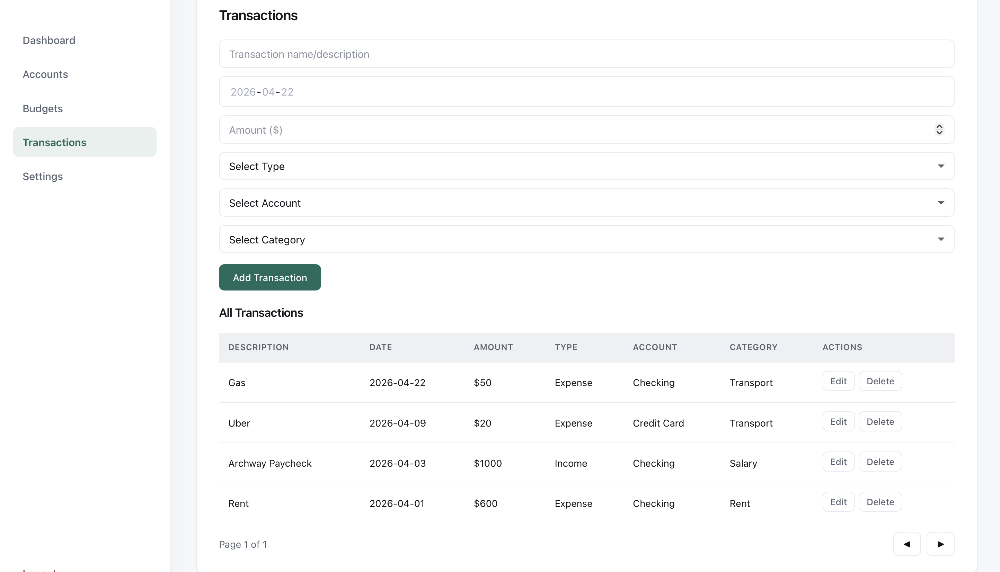
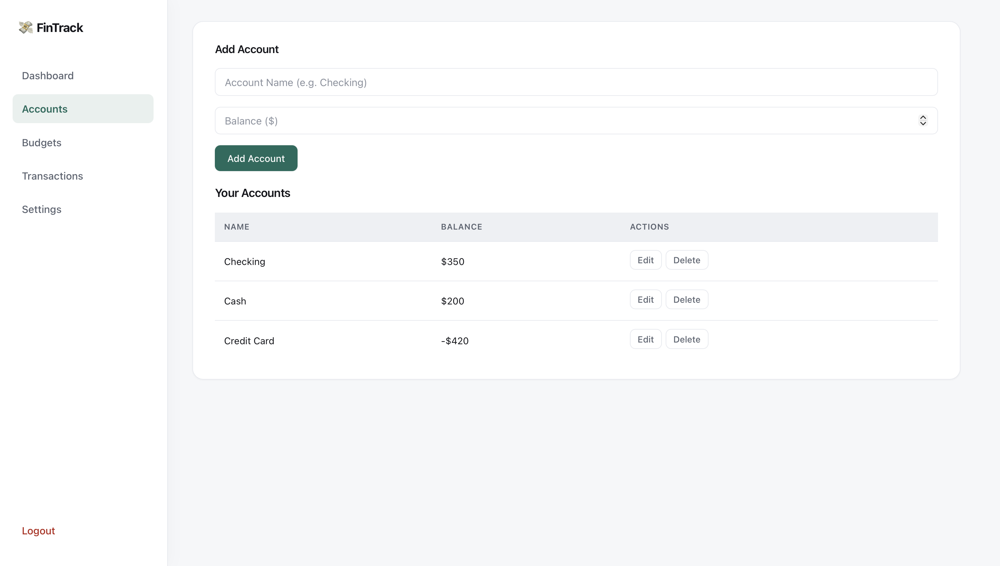
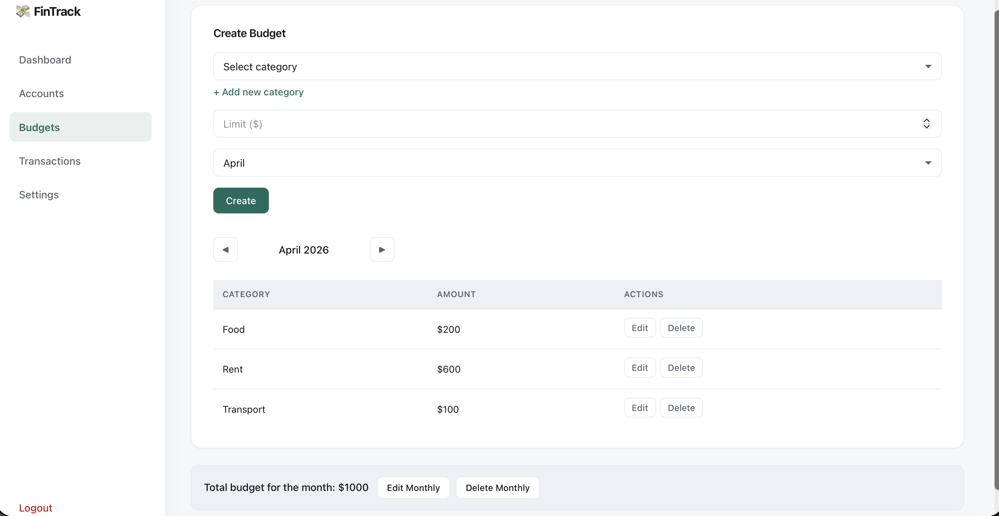

```markdown
# Personal Finance Tracker

## Project Summary

This project is a full stack personal finance tracker application designed to help users manage their finances effectively. It allows users to track income and expenses, manage multiple accounts, categorize transactions, and monitor budgets through a centralized dashboard. The system provides real time financial insights such as total balance, monthly spending, and remaining budget, helping users make informed financial decisions.

---

## Quick Start

### 1. Clone the Repository

```bash
git clone https://sc-gitlab.ufv.ca/202601comp351on1/Diana.Emal/project
```

### 2. Backend Setup (FastAPI)

```bash
cd backend
python -m venv venv
source venv/bin/activate   # Mac/Linux
# venv\Scripts\activate    # Windows

pip install -r requirements.txt
alembic upgrade head
uvicorn app.main:app --reload
```

**Backend runs at:** `http://localhost:8000`

### 3. Frontend Setup (React)

```bash
cd frontend
npm install
npm start
```

**Frontend runs at:** `http://localhost:3000`

### 4. Environment Configuration

- Ensure backend is running before starting frontend
- Configure API base URL if needed (`axios` config)

---

## Features

### User Authentication
- Secure login/logout using JWT (access + refresh tokens)
- Cookies used for persistent sessions

### Accounts Management
- Create, update, and delete accounts
- Track balances across multiple accounts

### Transactions
- Record income and expense transactions
- Associate transactions with accounts and categories

### Categories & Budgets
- Organize transactions using categories
- Set monthly budgets and track spending

### Dashboard
- Overview of total balance, income, expenses, and net
- Monthly budget tracking and remaining balance

### Transaction Filtering
- Filter by type (income/expense)
- Filter by category, account, description
- Filter by date range

### Token Refresh Handling
- Axios interceptors automatically refresh expired tokens
- Prevents user interruption during active sessions

---

## Technology Stack

### Backend
| Technology | Purpose |
|------------|---------|
| FastAPI (Python 3.12) | Web framework |
| SQLAlchemy | ORM |
| SQLite | Database |
| Alembic | Migrations |

### Frontend
| Technology | Purpose |
|------------|---------|
| React (18+) | UI framework |
| Axios | API requests |
| React Router | Navigation |

### Authentication
| Technology | Purpose |
|------------|---------|
| JWT | Token-based authentication |
| HTTP-only cookies | Secure token storage |

---


## Screenshots

### Dashboard View
*Main overview showing total balance, monthly income/expenses, and budget tracking*


*List all transactions with filtering by date, category, type, account, and description*


### Transactions Page
*List all transactions with pagination*



### Accounts Management
*Create and manage multiple financial accounts*



### Budget Tracking
*Set monthly budgets and monitor spending*



---

*Screenshots taken from version 1.0.0*

---

## Known Limitations

| Limitation | Description |
|------------|-------------|
| Scalability | SQLite may not scale well for large datasets |
| No RBAC | No role-based access control (single-user system) |

---

## License

*Add license information here*

## Contributors

*Diana Emal*

## Support

For issues or questions, please [open an issue](https://github.com/your-username/finance-tracker/issues) on GitHub.
```
